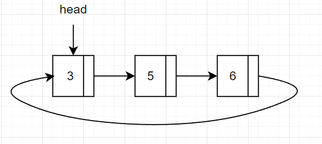
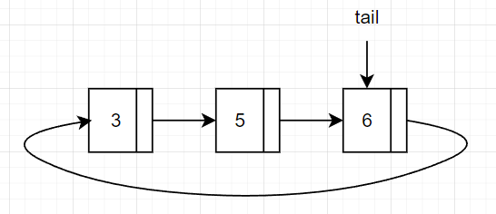

# Listas

## Tipo de Dato Abstracto Lista

Pueden implementarse se muchas formas. Las más comunes son:

- **ArrayList**: Implementación mediante arreglos
- **SinglyLinkedList**: Implementación mediante listas simples enlazadas
- **DoubleLinkedList**: Implementación mediante listas doblemente enlazadas
- **CircularLinkedList**: Implementación mediante listas enlazadas circulares

## Implementación mediante arreglos

```java
public class ArrayList implements List {
    private int maxSize;
    private int currentSize;
    private int[] storage;

    public ArrayList(int size) {
        this.maxSize = size;
        this.currentSize = 0;
        this.storage = new int[size];
    }

    public void clear() {
        this.currentSize = 0;
    }

    public boolean isEmpty() {
        return this.currentSize == 0;
    }

    public int size() {
        return this.currentSize;
    }

    public boolean contains(int element) {
        for (int i = 0; i < this.maxSize; i++) {
            if (this.storage[i] == element) {
                return true;
            }
        }
        return false;
    }

    public boolean add(int element) {
        if (this.currentSize > this.maxSize) {
            return false;
        }
        this.storage[currentSize++] = element;
        return true;
    }

    public int remove(int element) {
        int i;
        for (i = 0; i < this.maxSize; i++) {
            if (this.storage[i] == element) {
                indexToRemove = i;
            }
        }
        if (i == this.maxSize) {
            throw new NoSuchElementException();
        }
        for (int j = i; j < this.currentSize - 1; j++) {
            this.storage[j] = this.storage[j + 1];
        }
        this.currentSize--;
    }
}
```

- Algunos lenguajes explicitamente proveen soporte para ArrayList
- **La principal ventaja** que proveen en vez de usar directamente es la abstracción de más alto nivel. El programador no tiene que lidiar con _shifts_, re-sizes u otros problemas de usar arreglos directamente
- Una estrategia que se puede utilizar para evitar lanzar una excepción al llegar al tamaño máximo, es crear un nuevo array de mayor tamaño y copiar los elementos del array actual. Pero si tendrá un _hit_ de performance.

## Implementación mediante listas simples enlazadas

> Todos los enfoques utilizando listas enlazadas utilizan memoria dinámica en vez de un arreglo, es decir, asigna memoria en el _heap_ cada vez que un elemento se agrega
>
> Dado que crea la memoria _justo en el momento_, cada elemento de la lista está separado en la memoria (a diferencia de un array donde todos los elementos están en memoria contigua)

- Cada elemento de la lista es un _nodo_. Cada nodo tiene dos partes:
  - El **valor**: es el elemento relevante para el programador. El valor que solicitó registrar en la lista. Por ejemplo, `add(3)`, el 3 es el valor de interés para el programador
  - Una **referencia** al nodo siguiente que actua como el elemento que encadena la lista.
- Visualmente, una lista enlazada se puede representar como:
  
  - Como se puede notar, el último elemento apunta a _null_ indicando el fin de la lista
  - Es esencial llevar y mantener una referencia a la cabeza de la lista. Si la cabeza de la lista se pierde, se pierde toda la lista.
  - Opcionalmente y para mejorar la eficiencia de la inserción al final, se puede llevar una referencia a la cola de la lista. Este tipo se conoce como _DoubleEndedLinkedList_.

### Estructura general en Java

```java
// No es public, es una clase interna para no exponer la clase nodo a
// otras clases fuera del paquete
class Node {
    int value;
    Node next;

    public Node(int value) {
        this.value = value;
        this.next = null;
    }
}

public class SinglyLinkedList implements List {
    private Node head;
    private int size;

    public SinglyLinkedList() {
        this.head = null;
        this.size = 0;
    }

    public void clear() {
        this.head = null;
        this.size = 0;
    }

    public boolean isEmpty() {
        return this.size == 0;
    }

    public int size() {
        return this.size;
    }

    public boolean contains(int element) {
        Node current = this.head;
        while (current != null) {
            if (current.value == element) {
                return true;
            }
            current = current.next;
        }
        return false;
    }

    public boolean add(int element) {
        Node newNode = new Node(element);
        if (this.head == null) {
            this.head = newNode;
        } else {
            Node current = this.head;
            while (current.next != null) {
                current = current.next;
            }
            current.next = newNode;
        }
        this.size++;
        return true;
    }

    public int remove(int element) {
        if (this.head == null) {
            throw new NoSuchElementException();
        }
        if (this.head.value == element) {
            this.head = this.head.next;
            this.size--;
            return element;
        }
        Node current = this.head;
        while (current.next != null) {
            if (current.next.value == element) {
                current.next = current.next.next;
                this.size--;
                return element;
            }
            current = current.next;
        }
        throw new NoSuchElementException();
    }
}

```

## Implementación mediante lista doblemente enlazada

- La lista doblemente enlazada es similar a la lista simple enlazada, pero cada nodo tiene una referencia al nodo anterior y al siguiente
- Visualmente, una lista doblemente enlazada se puede representar como:
  
- La ventaja sobre la lista simple enlazada es que se puede recorrer la lista en ambas direcciones. La desventaja es que cada nodo tiene que mantener una referencia adicional al nodo anterior, lo que consume más memoria e implica mayor complejidad en la implementación.

### Estructura general en Java

```java
class Node {
    int value;
    Node next;
    Node prev;

    public Node(int value) {
        this.value = value;
        this.next = null;
        this.prev = null;
    }
}

public class DoubleLinkedList implements List {
    private Node head;
    private int size;

    public DoubleLinkedList() {
        this.head = null;
        this.size = 0;
    }

    public void clear() {
        this.head = null;
        this.size = 0;
    }

    public boolean isEmpty() {
        return this.size == 0;
    }

    public int size() {
        return this.size;
    }

    public boolean contains(int element) {
        Node current = this.head;
        while (current != null) {
            if (current.value == element) {
                return true;
            }
            current = current.next;
        }
        return false;
    }

    public boolean add(int element) {
        Node newNode = new Node(element);
        if (this.head == null) {
            this.head = newNode;
        } else {
            Node current = this.head;
            while (current.next != null) {
                current = current.next;
            }
            current.next = newNode;
            newNode.prev = current;
        }
        this.size++;
        return true;
    }

    public int remove(int element) {
        if (this.head == null) {
            throw new NoSuchElementException();
        }
        if (this.head.value == element) {
            this.head = this.head.next;
            if (this.head != null) {
                this.head.prev = null;
            }
            this.size--;
            return element;
        }
        Node current = this.head;
        while (current.next != null) {
            if (current.next.value == element) {
                current.next = current.next.next;
                if (current.next != null) {
                    current.next.prev = current;
                }
                this.size--;
                return element;
            }
            current = current.next;
        }
        throw new NoSuchElementException();
    }
}

```

### Aplicabilidad

- Cuando se necesita recorrer la lista en ambas direcciones, por ejemplo, en un editor de texto, donde se necesita recorrer el texto hacia adelante y hacia atrás o en un navegador web, donde se necesita recorrer el historial de navegación hacia adelante y hacia atrás.

## Implementación mediante lista enlazada circular

- La lista enlazada circular es similar a la lista simple enlazada, pero el último nodo apunta al primer nodo
- Visualmente, una lista enlazada circular se puede representar como:
  
- Usualmente se implementan como cirular doblemente enlazada.
- Para mejorar las inserciones, en vez de mantener la referencia a _head_ se utiliza una referencia a _tail_ únicamente:
  

### Estructura general en Java

```java
class Node {
    int value;
    Node next;

    public Node(int value) {
        this.value = value;
        this.next = null;
    }
}
public class CircularSinglyLinkedList {
    private Node tail;
    private int size;

    public CircularSinglyLinkedList() {
        this.tail = null;
        this.size = 0;
    }

    public void clear() {
        this.tail = null;
        this.size = 0;
    }

    public boolean isEmpty() {
        return this.size == 0;
    }

    public int size() {
        return this.size;
    }

    public boolean contains(int element) {
        if (this.tail == null) {
            return false;
        }
        Node current = this.tail.next;
        while (current != this.tail) {
            if (current.value == element) {
                return true;
            }
            current = current.next;
        }
        return current.value == element;
    }

    public boolean add(int element) {
        Node newNode = new Node(element);
        if (this.tail == null) {
            newNode.next = newNode;
            this.tail = newNode;
        } else {
            newNode.next = this.tail.next;
            this.tail.next = newNode;
            this.tail = newNode;
        }
        this.size++;
        return true;
    }

    public int remove(int element) {
        if (this.tail == null) {
            throw new NoSuchElementException();
        }
        Node current = this.tail.next;
        Node prev = this.tail;
        while (current != this.tail) {
            if (current.value == element) {
                prev.next = current.next;
                this.size--;
                return element;
            }
            prev = current;
            current = current.next;
        }
        if (current.value == element) {
            if (this.size == 1) {
                this.tail = null;
            } else {
                prev.next = current.next;
                if (current == this.tail) {
                    this.tail = prev;
                }
            }
            this.size--;
            return element;
        }
        throw new NoSuchElementException();
    }
}
```

### Aplicabilidad

Cuando se necesita una lista que no tenga un final o un principio, por ejemplo, una lista de reproducción de música, donde la última canción apunta a la primera o una lista de tareas pendientes, donde la última tarea apunta a la primera.

## Tabla comparativa de implementaciones

| Implementación | Ventajas                                                                                                                      | Desventajas                                                                                                                                           |
| -------------- | ----------------------------------------------------------------------------------------------------------------------------- | ----------------------------------------------------------------------------------------------------------------------------------------------------- |
| ArrayList      | - Acceso aleatorio rápido                                                                                                     | - Inserciones y eliminaciones son costosas<br/>- Uso ineficiente de memoria (Un arreglo grande poco usado, sigue utilizando toda la memoria asignada) |
| LinkedList     | - Inserciones y eliminaciones son rápidas<br/>-Uso más eficiente de la memoria aunque cada nodo tiene un _overhead_ adicional | - Acceso aleatorio a los elementos es costoso                                                                                                         |

