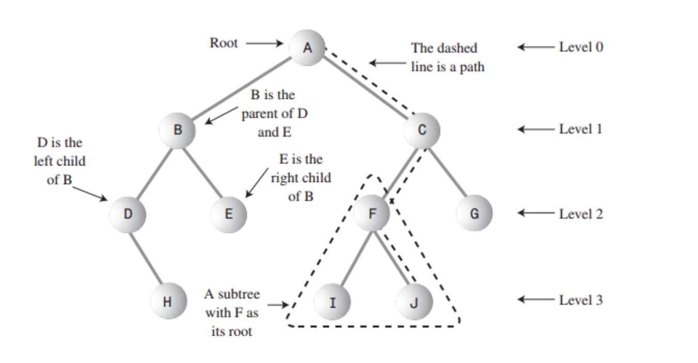

# Estructuras de datos jerárquicas

Son estructuras de datos que permiten organizar los datos de manera jerárquica, es decir, en forma de árbol. Los datos se organizan de manera que exista un nodo raíz y cada nodo puede tener cero o más nodos hijos. Cada nodo hijo puede tener a su vez cero o más nodos hijos, y así sucesivamente.

Existen muchos tipos de árboles, cada uno con sus propias características y aplicaciones. Algunos de los árboles más comunes son:

- **Árboles binarios**: cada nodo tiene a lo sumo dos hijos.

  - **Árboles binarios de búsqueda**: Es un árbol binario con ciertas reglas que permiten realizar búsquedas eficientes.
  - **Árboles AVL**: Es un árbol binario de búsqueda balanceado.
  - **Árboles splay**: Es un árbol binario de búsqueda que reorganiza los nodos para que los nodos más utilizados estén cerca de la raíz.
  - **Árboles de expresiones**: Es un árbol que se utiliza para representar expresiones matemáticas.
  - **Árboles rojinegros**: Es un árbol binario de búsqueda balanceado.
  - **Heap**: Es un árbol binario que cumple con ciertas reglas y se utiliza para implementar colas de prioridad.

- **Arboles N-arios**: Cada nodo puede tener un número variable de hijos.
  - **Árboles B**: Es un árbol que permite almacenar grandes cantidades de datos en disco.
  - **Árboles B+**: Es una variante del árbol B que se utiliza en bases de datos y sistemas de archivos.
  - **Árboles trie**: Es un árbol que se utiliza para almacenar un conjunto de cadenas de caracteres.
  - **Árboles de sufijos**: Es un árbol que se utiliza para almacenar todas las subcadenas de una cadena de caracteres.

A excepción de algunos árboles que puede implementarse con arreglos, la mayoría de los árboles se implementan con nodos enlazados, de forma similar a las _Listas_.

## Terminología básica

# Tipo de dato abstracto Árbol

Los árboles tienen las siguientes operaciones básicas:

- **Insertar (insert)**: añade un nodo al árbol,
- **Eliminar (delete)**: elimina un nodo del árbol,
- **Buscar (search)**: busca un nodo en el árbol,
- **Recorrer (traverse)**: recorre todos los nodos del árbol. Se puede realizar en distintos órdenes:
  - **Preorden**: primero se visita la raíz, luego el subárbol izquierdo y finalmente el subárbol derecho.
  - **Inorden**: primero se visita el subárbol izquierdo, luego la raíz y finalmente el subárbol derecho.
  - **Postorden**: primero se visita el subárbol izquierdo, luego el subárbol derecho y finalmente la raíz.
  - **Por niveles**: se recorren todos los nodos de un nivel antes de pasar al siguiente nivel.
