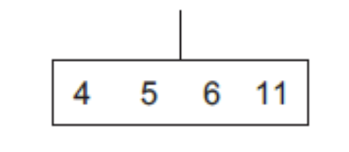
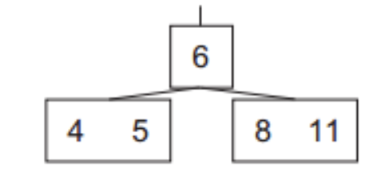
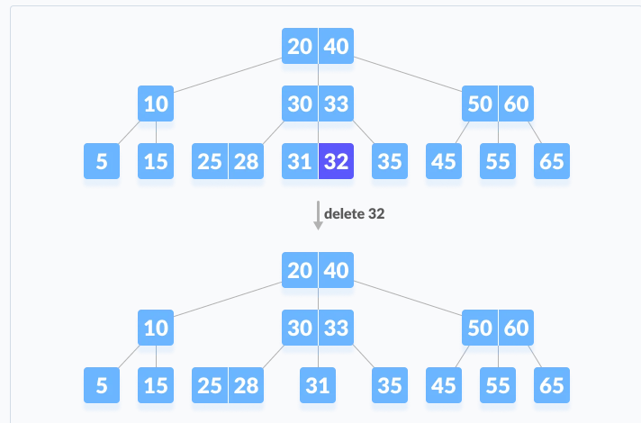

# Árboles B

Los árboles B son una variante de los árboles N-arios que se utilizan para almacenar grandes cantidades de datos en disco. Los árboles B son muy utilizados en bases de datos y sistemas de archivos.

Descritos por Rudolf Bayer y Edward M. McCreight en 1972, los árboles B son árboles balanceados que se caracterizan por tener un número variable de hijos por nodo. Los árboles B son muy similares a los árboles binarios de búsqueda, pero con la diferencia de que cada nodo puede tener más de dos hijos.

Visualmente se pueden representar de la siguiente forma:


## Características

Un árbol B de orden _m_, tiene las siguientes características:

- Cada nodo se compone de llaves y ramas. Las llaves están ordenadas y dividen las ramas en el órden esperado. Por ejemplo, entre las llaves 15 y 20, hay un nodo hijo, cuyas llaves serán mayores a 15 pero menores a 20.
- Todas las hojas están al mismo nivel.
- Se define con un orden _m_, que depende del tamaño del bloque del disco
- Cada nodo excepto la raíz **debe** contener al menos _m-1_ llaves. La raíz contiene un mínimo de una una llave.
- Todos los nodos (incluída la raíz) tienen a lo sumo _2\*m-1_ llaves.
- La inserción siempre ocurre en las hojas.
- Crecen o decrecen desde la raíz.

> Pueden implementarse en memoria principal o en secundaria (propósito original). En este curso, nos enfocaremos en la implementación en memoria principal.

## Estructura básica en Java

```java
class BTreeNode {
    int order;
    int[] keys;
    int keyCount;
    BTreeNode[] branches;
}
```

# Búsqueda
Es muy similar a la búsqueda de un elemento en un BST. Los pasos se pueden resumir de la siguiente manera para buscar una llave _k_:

1. Iniciando en la raíz, se compara _k_ con las llaves del nodo. Si _k_ se encuentra, se retorna el nodo o `true`. 
2. Al ir comparando a _k_ con cada una de las llaves, si se encuentra alguna llave mayor a _k_ (o se llega al final de las llaves, osea _k_ es mayor que todas), y hay una rama para dicha llave, se desciende por esa rama y se repite el proceso.
3. Si estamos en una rama, y no se encuentra _k_ en las llaves, se return `null` o `false`

```java
private Node Search(Node x, int key) {
    int i = 0;
    if (x == null)
      return x;
    for (i = 0; i < x.n; i++) {
      if (key < x.key[i]) {
        break;
      }
      if (key == x.key[i]) {
        return x;
      }
    }
    if (x.leaf) {
      return null;
    } else {
      return Search(x.child[i], key);
    }
  }
```  

# Inserción

El árbol B crece hacia arriba desde la raíz. La inserción siempre ocurre en las hojas.

El proceso de inserción para una llave _k_ sería:

- Se busca la llave en la raíz, entre las llaves del nodo.
- Dado que las llaves del nodo están ordenadas, se detiene si hay una llave mayor. Si tiene un hijo, se desciende a él y se repite el proceso.
- Si el nodo no tiene hijos:
  - Si el nodo no está lleno, se inserta en la posición correspondiente del arreglo de llaves
  - Si el nodo está lleno, se divide el nodo.

El proceso de división de un nodo _n_ con _2\*m-1_ llaves es el siguiente:

1. Se selecciona la llave mediana _m_ y se sube al nodo padre.
2. Se crean dos nuevos nodos, _n1_ y _n2_.
3. Se distribuyen las llaves de _n_ entre _n1_ y _n2_.
4. Se actualizan las ramas de _n1_ y _n2_.

El proceso de división se repite hasta llegar a la raíz.

Graficamente se puede ver de la siguiente manera (orden 5):



> La raíz está llena. Al insertar la llave 8:



> Varios elementos después:


> Varios elementos después...:


# Eliminación
Eliminar en un árbol B consiste de:
1. Encontrar el nodo que contiene la llave a eliminar.
2. Eliminar la llave del nodo.
3. Balancear el árbol para 

## Caso #1 - El nodo es hoja
En este caso, la llave por eliminar está en un nodo _hoja_. Hay dos sub-casos:
 
*1.1* El nodo tiene más de _m-1_ llaves. En este caso, simplemente se elimina la llave.

Por ejemplo en este árbol de orden 3:



*1.2* El nodo tiene _m-1_ llaves. En este caso, se _pide prestado_ una llave de uno de los nodos hermanos. Primero se visita el hermano izquierdo. Si el hermano izquierdo tiene más de _m-1_ llaves, se toma la llave más grande del hermano izquierdo Si no, se chequea el hermano derecho


Si los dos hermanos tienen _m-1_ llaves, se fusionan los nodos y se elimina la llave del nodo padre. La mezcla de los nodos se haces mediante el nodo padre.

https://www.programiz.com/dsa/deletion-from-a-b-tree#google_vignette