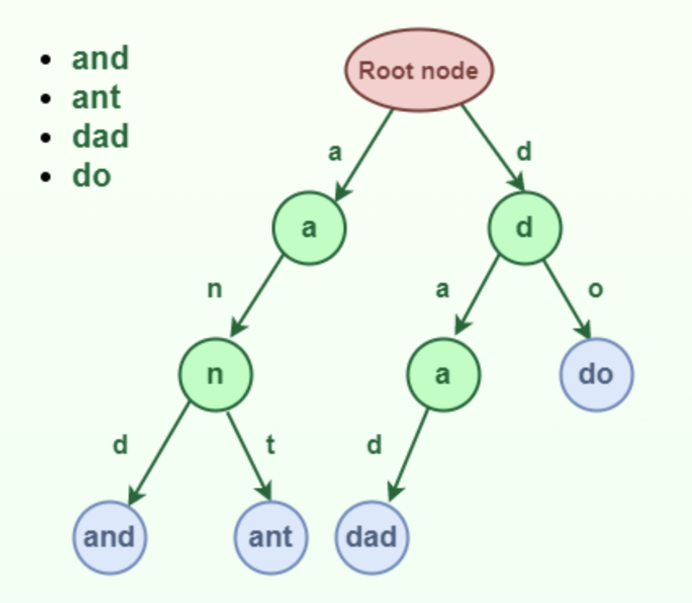
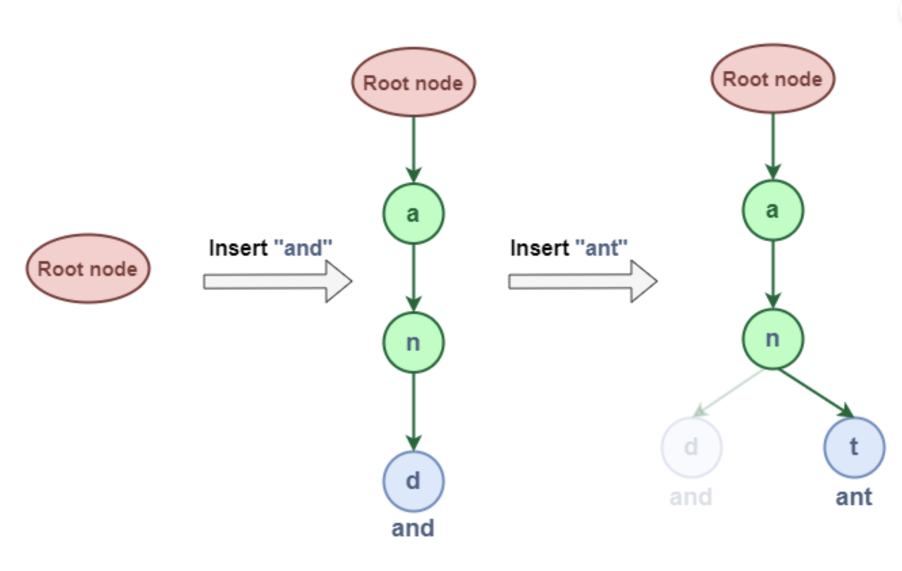

# Introducción a Tries

Un Trie (del inglés _reTRIEval_) es una estructura de datos que permite almacenar un conjunto de cadenas de caracteres y realizar búsquedas de palabras en ellas. Los Tries son árboles de búsqueda n-arios que almacenan cadenas de caracteres, donde cada nodo del árbol representa un carácter. Los Tries son útiles para realizar búsquedas de palabras en un conjunto de cadenas de caracteres, como en diccionarios o en motores de búsqueda.

> Se pronuncia como el inglés _try_.

Visualmente, un trie se puede ilustrar como:



Cada rama de un nodo corresponde a un caracter de la llave insertada. El último nodo de cada llave se conoce como _EndOfWord_. La raíz no tiene un valor asignado.

# El TDA Trie

El TDA Trie tiene las siguientes operaciones básicas:

- **Insertar (insert)**: añade una cadena de caracteres al trie,
- **Buscar (search)**: busca una cadena de caracteres en el trie,
- **Eliminar (delete)**: elimina una cadena de caracteres del trie.

# Implementación de un Trie

## Estructura básica

```java
class TrieNode
{
    TrieNode[] children = new TrieNode[ALPHABET_SIZE];
    boolean isEndOfWord;

    TrieNode(){
        isEndOfWord = false;
        for (int i = 0; i < ALPHABET_SIZE; i++)
            children[i] = null;
    }
}

class Trie
{
    TrieNode root;
}
```

## Inserción

Insertar una _llave_ en un Trie es un proceso simple:

- Cada caracter de la llave se inserta como un nodo Trie individual.
- Los hijos de un nodo son un arreglo de punteros (o referencias) a los nodos del siguiente nivel del trie.
- El caracter de la llave actúa como un índice para el arreglo de hijos. Si la llave de entrada es nueva o una extensión de la llave existente, se construyen nodos no existentes de la llave y se marca el final de la palabra para el último nodo.
- Si la llave de entrada es un prefijo de la llave existente en el Trie, simplemente se marca el último nodo de la llave como el final de una palabra.

La longitud de la llave determina la profundidad del Trie.



```java
void insert(String key) {
    int level;
    int length = key.length();
    int index;

    TrieNode pCrawl = root;

    for (level = 0; level < length; level++) {
        index = key.charAt(level) - 'a';
        if (pCrawl.children[index] == null)
            pCrawl.children[index] = new TrieNode();

        pCrawl = pCrawl.children[index];
    }

    // mark last node as leaf
    pCrawl.isEndOfWord = true;
}
```

## Búsqueda

Buscar una llave en un Trie es similar a la operación de inserción. Sin embargo, se detiene si no hay más caracteres en la llave o si no hay más nodos en el Trie. La búsqueda puede terminar debido al final de una cadena o la falta de una llave en el Trie.

- En el primer caso, si el campo isEndOfWord del último nodo es verdadero, entonces la llave existe en el Trie.
- En el segundo caso, la búsqueda termina sin examinar todos los caracteres de la llave, ya que la llave no está presente en el Trie.

```java
boolean search(String key) {
    int level;
    int length = key.length();
    int index;
    TrieNode pCrawl = root;

    for (level = 0; level < length; level++) {
        index = key.charAt(level) - 'a';

        if (pCrawl.children[index] == null)
            return false;

        pCrawl = pCrawl.children[index];
    }
    return (pCrawl.isEndOfWord);
}
```
