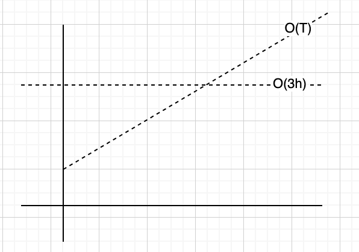
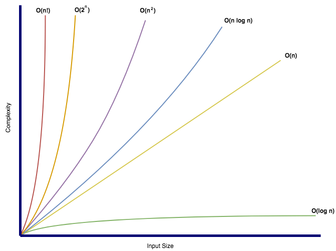

# Análisis teórico de algoritmos

Parte de la teoría de complejidad computacional que provee estimación teórica de los recursos (tiempo, espacio) que un algoritmo requiere para ejecutarse.

- No depende de la máquina
- No es sencillo de calcular
- No requiere ejecutar el programa.
- Se enfoca en algoritmos y no en programas completos.

El output del análisis teórico es una función que describe el comportamiento del algoritmo. Por ejemplo, si se tiene un algoritmo de ordenamiento, se puede obtener una función que describe el tiempo que el algoritmo requiere para ordenar una lista de tamaño _n_.

- Si la función crece lento para valores grandes de _n_, el algoritmo es eficiente.

# Enfoques de análisis teórico

- _Complejidad como función del input_: calcular una función contando las operaciones elementales que el algoritmo realiza.

> Operaciones fundamentales son aquellas que se realizan en tiempo constante. Por ejemplo, una suma, una multiplicación, una comparación, etc.

- _Comportamiento asintótico_: sin calcular una función exacta, se busca una función que describa el comportamiento del algoritmo para valores grandes de _n_.

## Complejidad como función del input

Se consideran operaciones fundamentales, es decir, operaciones que se realizan en tiempo constante. Por ejemplo, una suma, una multiplicación, una comparación, etc.

El tiempo que toma cada operación fundamental se designa con una constante T.

Por ejemplo, para el siguiente algoritmo:

```java
int max(int[] array) {
    int max = array[0];
    for (int i = 1; i < array.length; i++) {
        if (array[i] > max) {
            max = array[i];
        }
    }
    return max;
}
```

La función que describe el tiempo que el algoritmo requiere para encontrar el máximo de un arreglo de tamaño _n_ es:

```java
int max = array[0]; ------------------------> 3T
for (int i = 1; i < array.length; i++) { ---> T + 2nT
    if (array[i] > max) { ------------------> 2T(n-1)
        max = array[i]; --------------------> 2T(n-1)
    }
}
```

Por lo tanto, `f(n) = 4T + 6nT`

## Análisis asintótico

Suponga que usted necesita enviar un archivo a un amigo en Guanacaste. ¿Qué es más rápido, enviarlo por correo/FTP o llevarlo personalmente? Asumiento que ir a Guanacaste sin presas, tarda siempre 3 horas, podríamos tener el siguiente grafico:



No importa que tan grande sea el archivo, llevarlo físicamente siempre tarda lo mismo. Por medio electrónico, el tiempo de transferencia depende del tamaño del archivo y en algún momento será mayor que las 3 horas que tarda llevarlo físicamente.

Análisis asistóntico busca encontrar la función que represente el crecimiento con respecto a _n_.

### Eliminar las constantes

Considere la función que calculamos tiempo atrás: `f(n) = 4T + 6nT`. Análisis asintótico elimina los términos de menor relevancia, es decir, los que no son significativos para el crecimiento de la función. De igual forma las constantes se eliminan. Por lo tanto, dicha función se puede expresar como

`f(n) = O(n)`

Lo que nos interesa en análisis asintótico, es la escalabilidad del algoritmo.

`O(nˆ2 + n) => O(nˆ2)`

`O(n + log(n)) => O(n)`

`O(5 * 2ˆn + 100nˆ2) => O(2ˆn)`

### Big O, Big Theta, Big Omega

Son notaciones para describir la ejecución de un algoritmo en términos de su comportamiento asintótico.

- _Big O_: describe el límite suuperior. Por ejemplo O(n^2), O(n), O(2ˆn). El algoritmo es al menos tan rápido como este límite. No sobrepasa el límite dictado por Big O

- _Big Omega_: describe el límite inferior. Es decir, el algoritmo tendrá un comportamiento al menos tan lento como este límite.

- _Big Theta_: describe el comportamiento exacto del algoritmo. Es decir, el algoritmo se comporta exactamente como esta función. Es el límite ajustado, _Big O_ y _Big Omega_.

> De estas notaciones, la más usada es _Big O_

## Mejor, peor y caso esperado/promedio

Formas de describir la ejecución del algoritmo. Por ejemplo, considerando la búsqueda en una lista enlazada sin ordenar:

- _Mejor caso_: O(1) cuando el elemento buscado ese l primero elemento consultado

- Caso Promedio: O(n) dado que el elemento buscado puede estar en cualquier posición de la lista.

- Caso peor: O(n) cuando el elemento buscado es el último elemento de la lista.

> El mejor, peor y caso promedio, se puede describir con cualquiera de las notaciones de complejidad asintótica. Es incorrecto que _Big O_ solo se refiere al peor caso, _Big Omega_ es el mejor y _Big Theta_ es el promedio.

## Sobre la complejidad espacial

La cantidad de memoria que el algoritmo requiere. Se puede describir con Big-O, Big-Omega y Big-Theta también.

```c
int sum(int n) {
    if (n <= 0) {
        return 0;
    }
    return n + sum(n-1);
}
```

La complejidad espacial de este algoritmo es O(n) dado que se requiere almacenar _n_ llamadas recursivas en la pila de llamadas. La complejidad temporal es O(n).

### Ejercicio de complejidad espacial

```c
int foo(int n) {
    int sum = 0;
    for (int i = 0; i < n; i++) {
        sum += bar(i);
    }
    return sum;
}

int bar(int a, int b) {
    return a + b;
}
```

No hay llamadas anidadas => `O(1)`

## Big-O conocidas



## Reglas generales para calcular complejidad espacial con Big-O

## Sumar o multiplicar complejidades

Si el algoritmo es de la forma: haga x y luego y, entonces es una suma:

```java
for (int a : arrayA) {
    // Do something
}
for (int b : arrayB) {
    // Do something
}
```

La complejidad es `O(n) + O(m) = O(n+m)` donde n es el tamaño de arrayA y m es el tamaño de arrayB.

De esto también podemos concluir que hacer dos iteraciones de un mismo array, sería: `O(n) + O(n) = O(2n) = O(n)`
