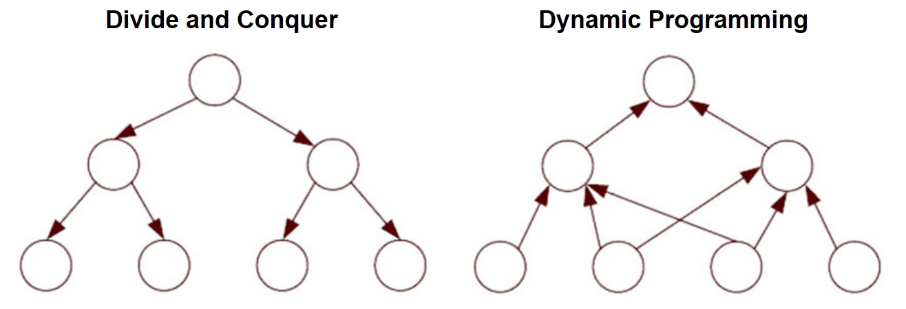

# Programación dinámica (DP)
Aunque tiene el término _programación_ en su nombre, no se refiere a escritura de código fuente. Acuñado por Richard Bellman en los años 50, _programar_ se referiere a _planificar_, es decir, planificar óptimamente procesos de múltiples etapas.
- Comparte similutudes con la técnica de _divide y vencerás_.
- DP divide problemas en sub-problemas y _memoiza_ las soluciones de los sub-problemas para resolverlos una *sola vez*.
- En DP, los sub-problemas se translapan, es decir, el resultado de uno puede ayudar a resolver otro.

> **Memoización vs Memorización <br/>**
> Memoización se refiere a una técnica para optimizar recordando. Memorizar se refiere a poner algo en la memoria.

Por ejemplo, para calcular _fibonacci(4)_ utilizando un enfoque tradicional:


Se puede notar un claro traslape de sub-problemas, lo que implica un desperdicio de recursos computacionales. Utilizando un enfoque de DP, el problema se puede resolver de la siguiente manera:

```java
int fib(n) {
    mem[n + 2]; // ------------------> En caso que N sea 0 o 1
    mem[0] = 0;
    mem[1] = 1;

    for (i = 2; i < n + 1; i++) {
        mem[i] = mem[i - 1] + mem[i - 2];
    }
    return mem[n];
}
```

El código anterior utilizaría internamente, un arreglo que se vería de la siguiente manera:

```
mem[0] = 0
mem[1] = 1
mem[2] = 1
mem[3] = 2
mem[4] = 3
```

En el enfoque divide y conquista, el algoritmo de Fibonacci tiene una complejidad de tiempo de `O(2^n)`. En cambio, con DP, la complejidad de tiempo se reduce a `O(n)`.

El siguiente diagrama ilustra el enfoque DP vs Divide y Vencerás de forma general:

